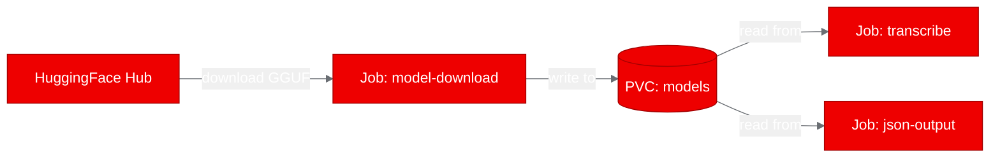

## Deploying a C++ speech-to-text engine on OpenShift: parakeet.cpp PoC

Speech-to-text inference doesn't have to mean a 10GB Python container with CUDA drivers and a PyTorch runtime. We deployed [parakeet.cpp](https://github.com/mudler/parakeet.cpp), a C++17 inference engine for NVIDIA's Parakeet ASR models, on Red Hat OpenShift AI using a slim UBI-based container. The result: accurate transcription from a 126MB quantized model running on CPU, with no Python, no GPU, and no external services.

Here's what we did, what worked, and what we learned.

## What is parakeet.cpp?

parakeet.cpp is a C++17 port of NVIDIA's NeMo Parakeet automatic speech recognition models, built on the [ggml](https://github.com/ggml-org/ggml) tensor library. It covers CTC, RNNT, TDT, and hybrid model architectures in sizes from 110M to 1.1B parameters.

The key selling point: it produces byte-identical transcripts to NeMo's PyTorch runtime while being faster on both CPU and GPU, with a fraction of the memory footprint. And at inference time, the only dependency is a single compiled binary plus the ggml shared libraries. No Python, no pip, no conda.

## Why containerize speech-to-text on OpenShift?

Enterprise teams running ASR workloads need:

- **Reproducible builds**: The same binary, same model, same output everywhere.
- **Security**: UBI-based images with non-root execution, no unnecessary packages.
- **Scheduling**: Kubernetes Job scheduling for batch transcription, or Deployment for persistent service.
- **Model management**: Version-controlled GGUF model files on persistent volumes.

parakeet.cpp's minimal dependency profile makes it a natural fit. The entire runtime is a statically-linked binary and a few shared libraries, totaling under 30MB before the model.

## Building with UBI: multi-stage Dockerfile

We used a multi-stage Dockerfile with Red Hat Universal Base Images:

```dockerfile
# Builder: compile on UBI-minimal
FROM registry.access.redhat.com/ubi9/ubi-minimal AS builder
RUN microdnf install -y gcc-c++ cmake make git ca-certificates && microdnf clean all
WORKDIR /src
COPY . .
RUN git clone --depth=1 https://github.com/ggml-org/ggml.git third_party/ggml
RUN cmake -B build -DCMAKE_BUILD_TYPE=Release -DGGML_NATIVE=OFF \
    && cmake --build build -j"$(nproc)"

# Runtime: just the binary + libs
FROM registry.access.redhat.com/ubi9/ubi-minimal
RUN microdnf install -y libgomp && microdnf clean all
COPY --from=builder /install/bin/ /usr/local/bin/
COPY --from=builder /install/lib/ /usr/local/lib/
COPY tests/fixtures/*.wav /audio/
USER 1001
ENTRYPOINT ["parakeet-cli"]
```

The builder stage installs only `gcc-c++`, `cmake`, `make`, and `git`. The runtime stage carries only `libgomp` (OpenMP for parallel inference). `-DGGML_NATIVE=OFF` produces a portable binary without host-specific CPU extensions.

The first build attempt failed because the ggml submodule was empty in the binary build context. We fixed this by cloning ggml directly during the build stage instead of relying on `git submodule update`.

## Deploying as Kubernetes Jobs

parakeet-cli is a CLI tool, not a server. Instead of a Deployment with a Service, we used Kubernetes Jobs:



1. **Model download Job**: A one-time `curl` job downloads the `tdt_ctc-110m-q4_k.gguf` model (126MB) from HuggingFace to a PersistentVolumeClaim.
2. **Transcription Jobs**: Each test scenario runs as a separate Job that mounts the model PVC and the bundled test audio files.

This pattern works well for batch ASR: submit a Job per audio file (or batch), let Kubernetes handle scheduling and resource allocation.

## Transcription results and accuracy

All four test scenarios passed on the first run:

| Test | Result | Output |
|---|---|---|
| CLI help | Pass | Full usage information displayed |
| Model info | Pass | Architecture: hybrid_tdt_ctc, 512/17/8 dimensions |
| Transcription | Pass | "Well, I don't wish to see it any more, observed Phoebe..." |
| JSON output | Pass | 23 words with timestamps and confidence scores |

The JSON output includes word-level timing and confidence:

```json
{"w": "Phoebe,", "start": 2.640, "end": 3.120, "conf": 0.7719}
```

The 110M-parameter model in q4_k quantization transcribed a 7-second audio clip in under 1 second on a 2-core CPU allocation. That's well above real-time speed.

## What we learned

Our first build failed because OpenShift binary builds upload a directory snapshot, stripping `.git` metadata. The ggml submodule arrived as an empty directory. The fix was straightforward: clone ggml directly in the Dockerfile instead of relying on `git submodule update`. If your project uses submodules, expect to hit this.

We initially deployed parakeet-cli as a Deployment, which immediately went into CrashLoopBackOff. The process exits after transcribing, so Kubernetes kept restarting it. Switching to the Job pattern solved this and turned out to be a better fit anyway: submit a Job per audio file, let Kubernetes handle scheduling.

The q4_k quantization is worth highlighting. It reduces the 110M model from ~500MB (f16) to 126MB, a 75% size reduction with negligible accuracy loss. For larger models in the 1.1B range, this compression matters even more for storage costs and cold-start times on shared infrastructure.

One small gotcha: HuggingFace model URLs require `curl -L` to follow redirects. Without the flag, you download a 15-byte redirect page instead of the model file.

## Try it yourself

A 126MB model, a single binary, no GPU. That's what production-ready ASR can look like on OpenShift.

1. Fork the [parakeet.cpp repository](https://github.com/mudler/parakeet.cpp)
2. Build with the UBI Dockerfile: `podman build -t parakeet-cpp:ubi -f Dockerfile.ubi .`
3. Download a GGUF model from [HuggingFace](https://huggingface.co/mudler/parakeet-cpp-gguf)
4. Run: `podman run -v ./models:/models parakeet-cpp:ubi transcribe --model /models/tdt_ctc-110m-q4_k.gguf --input /audio/speech.wav`

For OpenShift deployment, apply the Kubernetes manifests from the [`kubernetes/` directory](https://github.com/aicatalyst-team/parakeet.cpp/tree/master/kubernetes) in our fork. The full PoC report, test script, and deployment artifacts are on the [`autopoc-artifacts` branch](https://github.com/aicatalyst-team/parakeet.cpp/tree/autopoc-artifacts).
